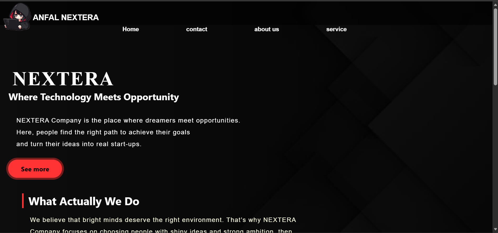
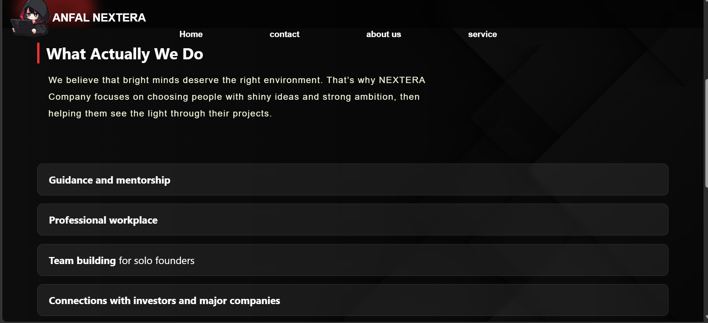
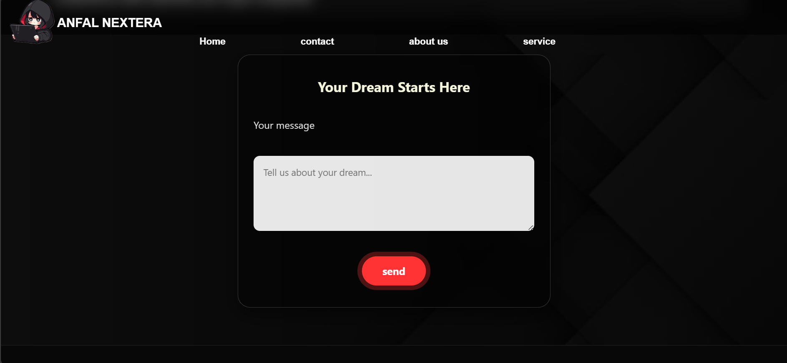

# ANFAL NEXTERA 🚀

A startup-style website concept built with HTML, CSS, and JavaScript.

---
## 📸 Project Preview

## 💡 About the Project

**ANFAL NEXTERA** is a creative concept of a digital company that aims to connect dreamers with opportunities and help transform ideas into real startup projects.

This project was created as a frontend practice to improve layout design, styling, and basic interactivity.

---

## 🛠️ Technologies Used

* HTML5
* CSS3
* PHP

---

## ✨ Features

* Clean and modern landing page
* Company-style design
* Organized layout (Navbar, Sections, Footer)
* Responsive design (in progress)

---

## 🚀 Future Improvements

* Add dark mode 🌙
* Add animations on scroll ✨
* Improve responsiveness 📱
* Add interactive features (forms, dynamic content)

---

## 🎯 Goal

The goal of this project is to practice frontend development by building a realistic company website from scratch and improving it step by step.

---

## ⭐ Notes

This is a beginner-friendly project and will be updated with more features over time.

---
